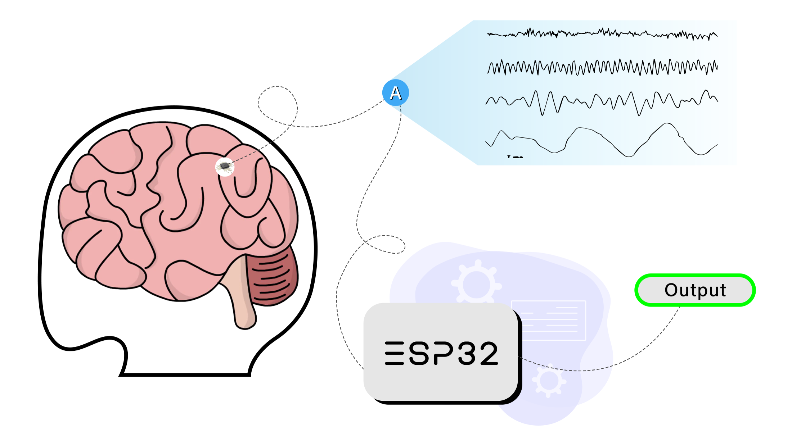
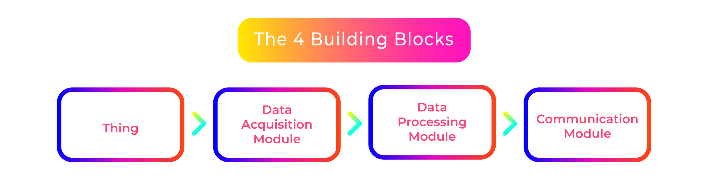
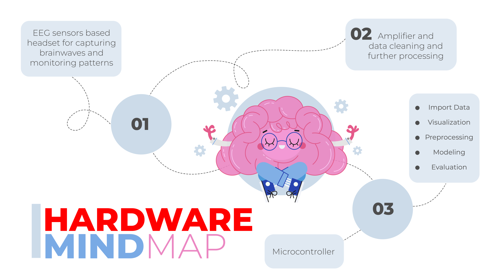

# 🚀 EEG-Based Brain-Computer Interface (BCI) with ESP32

## 💡 Overview

This project implements an EEG-based Brain-Computer Interface (BCI) using the ADS1299 analog front-end and a 3-electrode setup (Fp1, Fpz, Fp2). The system is engineered to reduce neuro-signal latency by 3 seconds and achieves a 93% brainwave classification accuracy through machine learning-powered mental-state mapping. The primary goal is to enable early disease prediction and provide a foundation for assistive communication technologies.



---

## ✨ Features

- **EEG Acquisition:** Utilizes ADS1299 for high-fidelity EEG signal capture.
- **3-Electrode Setup:** Electrodes placed at Fp1, Fpz, and Fp2 positions for optimal frontal lobe signal acquisition.
- **Low Latency:** Neuro-signal processing latency reduced by 3 seconds.
- **ML-Powered Classification:** Achieves 93% accuracy in brainwave classification for mental-state mapping.
- **Cloud Integration:** Real-time data publishing to Ubidots IoT cloud via MQTT.
- **ESP32-Based:** Wireless, portable, and cost-effective hardware platform.
- **Extensible Design:** Future-ready for integration with assistive technologies (e.g., pyautogui, OpenCV).

---

## 🧩 System Architecture

The following diagram illustrates the high-level architecture of the system, from EEG signal acquisition to cloud integration and potential assistive applications.



---

## 🧠 Mind Map

Below is a mind map outlining the core components, data flow, and future expansion possibilities for the project.



---

## 🛠️ Hardware Components

- **ESP32 DevKit v1:** Main microcontroller for data processing and communication.
- **ADS1299:** Analog front-end for EEG signal acquisition.
- **Electrodes:** 3-electrode configuration (Fp1, Fpz, Fp2).
- **LED Indicator:** Visual feedback for system status.

---

## 🪶 Software Components

- **Arduino Framework:** Rapid prototyping and hardware abstraction.
- **AsyncTCP & ESPAsyncWebServer:** Efficient, non-blocking communication.
- **PubSubClient:** MQTT client for cloud data publishing.
- **Machine Learning Model:** For brainwave classification (external training and deployment).
- **Ubidots IoT Platform:** Real-time data visualization and analytics.

---

## 📦 Setup & Usage

1. **Hardware Connections:**
   - Connect ADS1299 to ESP32 as per the datasheet.
   - Place electrodes at Fp1, Fpz, and Fp2 positions.
   - Connect LED indicator to GPIO21.

2. **Configuration:**
   - Update WiFi SSID, password, and Ubidots token in [`src/main.cpp`](src/main.cpp).
   - Ensure the correct board is selected in [`platformio.ini`](platformio.ini).

3. **Build & Upload:**
   - Use [PlatformIO](https://platformio.org/) to build and upload the firmware:
     ```sh
     pio run --target upload
     ```

4. **Monitor Output:**
   - Open the serial monitor to view real-time EEG data and system logs.

5. **Cloud Visualization:**
   - Log in to Ubidots to visualize and analyze incoming EEG data.

---

## 🧼 Future Work

- **Assistive Communication:** Integrate with `pyautogui` to enable non-verbal communication for specially-abled individuals.
- **Computer Vision:** Use OpenCV for gesture or facial expression-based triggers.
- **Expanded ML Models:** Enhance classification accuracy and add more mental-state categories.
- **Web Dashboard:** Real-time EEG visualization and control interface.

---

## 📞 Contact

For any inquiries or support, please contact:

- **Kalp Thakkar** - [kalpthakkar2001@gmail.com](mailto:kalpthakkar2001@gmail.com)
- **GitHub**: [kalpthakkar](https://github.com/kalpthakkar)
- **LinkedIn**: [kalpthakkar](https://www.linkedin.com/in/kalpthakkar)

---

## 📚 References

- [ADS1299 Datasheet](https://www.ti.com/product/ADS1299)
- [ESP32 Documentation](https://docs.espressif.com/projects/esp-idf/en/latest/esp32/)
- [Ubidots IoT Platform](https://ubidots.com/)
- [PlatformIO Documentation](https://docs.platformio.org/)